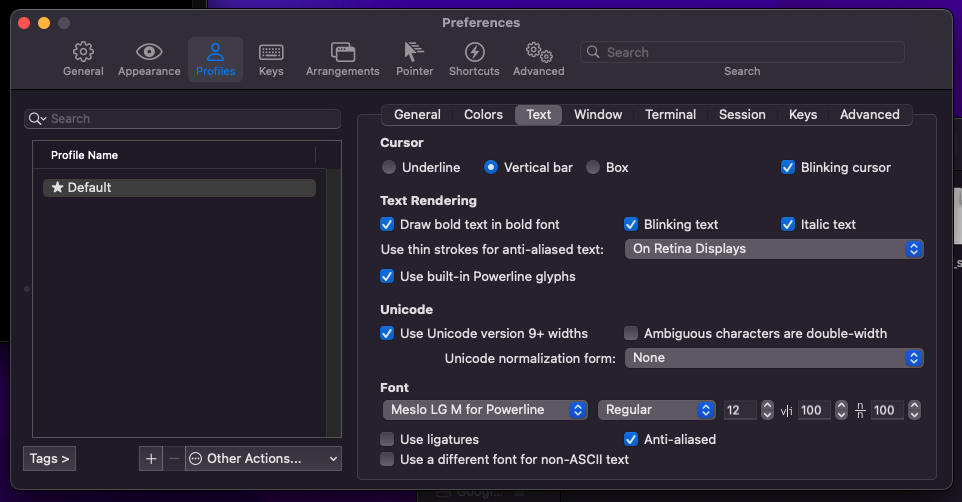

# new-machine-setup
This guide is used for setting up the development environment for a brand new machine (OSX)

## Homebrew
```https://brew.sh/```

## iTerm2 Setup Guide
### Install iTerm 2 with autocomplete
https://medium.com/@Clovis_app/configuration-of-a-beautiful-efficient-terminal-and-prompt-on-osx-in-7-minutes-827c29391961


## oh my zsh

### Install oh my zsh
``` sh -c "$(curl -fsSL https://raw.github.com/ohmyzsh/ohmyzsh/master/tools/install.sh)"```
### Set up spaceship/customized theme on oh my zsh
Clone this repo:
```
git clone https://github.com/denysdovhan/spaceship-prompt.git "$ZSH_CUSTOM/themes/spaceship-prompt"
```

Symlink spaceship.zsh-theme to your oh-my-zsh custom themes directory:
```
ln -s "$ZSH_CUSTOM/themes/spaceship-prompt/spaceship.zsh-theme" "$ZSH_CUSTOM/themes/spaceship.zsh-theme"
```

Set the zsh theme in .zshrc:
```
ZSH_THEME="spaceship"
```

Go to .oh-my-zsh/custom/themes/spaceship.zsh and override the custom spaceship_zsh-theme

Install powerline font:

clone
```
git clone https://github.com/powerline/fonts.git --depth=1
```
install
```
cd fonts
./install.sh
```

clean-up a bit
```
cd ..
rm -rf fonts
```

Auto suggestions for Oh My Zsh:

```
$ git clone https://github.com/zsh-users/zsh-autosuggestions $ZSH_CUSTOM/plugins/zsh-autosuggestions
Note: $ZSH_CUSTOM/plugins path is by default ~/.oh-my-zsh/custom/plugins
```
Add the plugin to the list of plugins in ~/.zshrcconfiguration file :
```
plugins=(
    …
    zsh-autosuggestions
)
```
Restart terminal


Syntax highlighting:
```
$ brew install zsh-syntax-highlighting
```

open `~/.zshrc` and place at the end of the file

```
source /usr/local/share/zsh-syntax-highlighting/zsh-syntax-highlighting.zsh
```

restart terminal

### Set up iTerm text profile
Import JSON profile using
[profile](./iterm-text-profile.json)


### Mac OS: xcrun: error: invalid active developer path, missing xcrun
```https://ma.ttias.be/mac-os-xcrun-error-invalid-active-developer-path-missing-xcrun/```

### zsh compinit: insecure directories and files
https://github.com/zsh-users/zsh-completions/issues/680


## nvm

### Installing nvm
https://github.com/nvm-sh/nvm

Add this to `.zshrc` if it's not already there

```
export NVM_DIR="$([ -z "${XDG_CONFIG_HOME-}" ] && printf %s "${HOME}/.nvm" || printf %s "${XDG_CONFIG_HOME}/nvm")"
[ -s "$NVM_DIR/nvm.sh" ] && \. "$NVM_DIR/nvm.sh" # This loads nvm
```

### unable to access global packages installed when switching between different versions of node
```
npm link [packagen name]
npm link @angular/cli
```

## Docker

### Installing docker
https://www.docker.com/get-started/

## Vscode

### Download Extension: "Settings Sync" by Shan Khan
Login with github and upload gist file

Lavie's settings Gist: https://gist.github.com/Lavioli/1b2c62b076434d98f7a8244274793ecb

### Check if git is installed:
```
git --version
```

### Check if node is installed:
```
node -v
```
If not, use nvm and download the latest version
```
nvm ls-remote
nvm install [version]
```

## Mongodb Installation

### Installing with brew
https://medium.com/better-programming/installing-mongodb-on-macos-catalina-aab1cbe0c836

### Using/switching to another version
https://stackoverflow.com/questions/30379127/how-to-install-earlier-version-of-mongodb-with-homebrew

### When running into mongod command not found
https://stackoverflow.com/questions/10203589/cant-use-mongo-command-shows-command-not-found-on-mac
set `export PATH=$PATH:/usr/local/opt/mongodb-community@4.0/bin` in the .zshrc

### Using mongorestore for Mongo Data Dump
Make sure app is running `mongod`

To seed data from data dump:
```
mongorestore --db=database-name directory-with-json-bson-files
```
## VMs

### Virtual Box Installation
https://www.virtualbox.org/wiki/Downloads

### Microsoft Development VM Image Download
https://developer.microsoft.com/en-us/windows/downloads/virtual-machines/

Extract the zip file and then select Import from VirtualBox

### UTM (For M1 Mac)
https://docs.getutm.app/guides/windows/#cannot-run-uup_download_macossh

### Accessing mac localhost from the VM
https://medium.com/@urubuz/accessing-localhost-in-mac-from-windows-vm-in-virtualbox-312a3de6fedb

## Set up Multiple Github Accounts Access using SSH
https://dev.to/worldofprasanna/manage-ssh-keys-for-multiple-github-accounts-2nf3

## Useful Apps

###For window resizing:
https://rectangleapp.com/

## Github 2-Factor Authentication for Git Cli
Set up a personal access token for accessing GitHub repositories - 
I recommend giving it gist, repo, and user scope. Make sure you copy the token now as you won't be able to later

## Show hidden files
```
Cmd + Shift + .
```

## Remove Mac Shortcut Key for Cmd Shift A that conflicts with Webstorm
```
https://intellij-support.jetbrains.com/hc/en-us/articles/360005137400-Cmd-Shift-A-hotkey-opens-Terminal-with-apropos-search-instead-of-the-Find-Action-dialog
```
